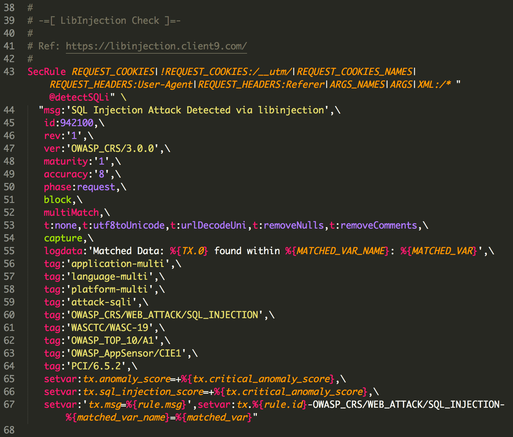

ModSecurity rule syntax for [Sublime Text](https://www.sublimetext.com)

1. Get [ModSecurity.tmLanguage](https://raw.githubusercontent.com/lifeforms/sublime-modsecurity/master/ModSecurity.tmLanguage)
2. Put it in Sublime Text `Packages/User/` directory
3. Open a `.conf` file, and switch it to ModSecurity syntax

